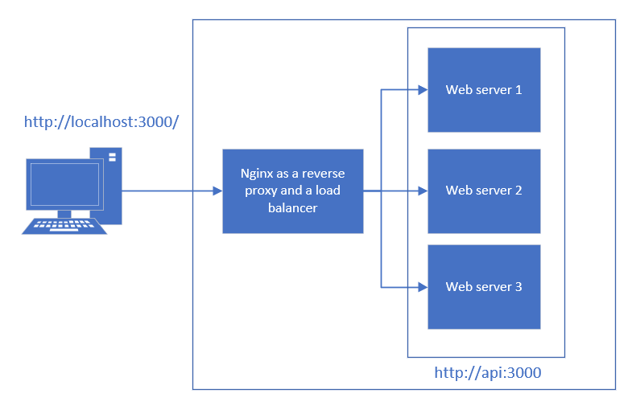

# Load balancer with Nginx

## Description

Load balancing is an important technique used to distribute incoming network traffic across multiple servers to ensure optimal resource utilization, maximize throughput, and minimize response time. In this project Nginx is configured as a load balancer for a set of web servers.

## Goal

This project is here to demonstrate my ability to work with Nginx, understand load balancing concepts, and configure a production-grade load balancer.

## Setup and configuration

Example of configuration with 3 containers : 

**Note** : The Nginx load balancer will also act as a reverse proxy.

## Run

To launch multiple container, run the command

`docker-compose up --scale api=X`

X : number of containers

A container will return its hostname as a response json.

The page is accessed on http://localhost:3000

By default, the Nginx load balancer uses a **round-robin algorithm**, wherein workloads are equally passed among the nodes, one after the next.

## Monitoring

You can manually check the load balancing by running the command :

`curl localhost:3000`

The domain name assigned by docker should vary equally between containers.

If you try to reload a page on http://localhost:3000 it will not change the hostname, due to the caching of the browser.

### stub_status

The stub_status module is enabled in the NGINX configuration (conf.d) by including the stub_status directive in a location block.

You can access the few important metrics about NGINX activity in the page http://localhost:3000/nginx_status.

Or by running the command `curl localhost:3000/nginx_status`
